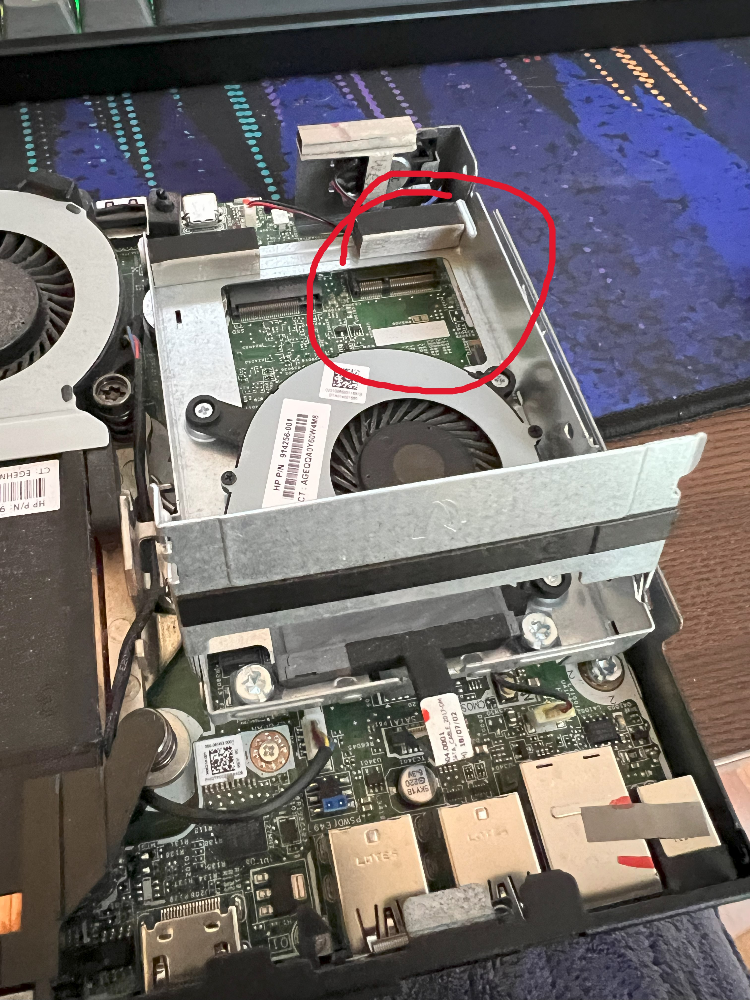
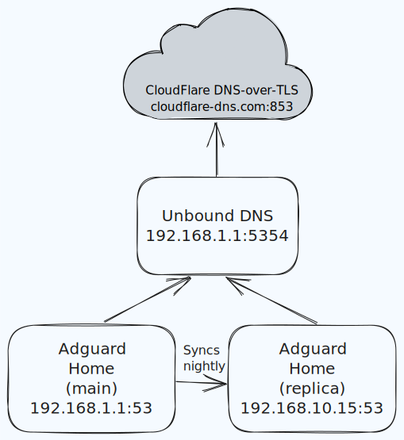

In 2021, I bought a Synology DS912+ as my storage needs expanded. Little did I
know, this started me down a longer path of home automation and networking.
Since then my home network has grown in devices and complexity.

One of the items on my home network improvement list was to replace my existing
router[^1] with a home built one for the many benefits of having your own
router: security, fun, and performance (mostly in that order!). I had already
installed DD-WRT and removed the wifi antennas my existing router after
switching over to some Ubiquiti access points, since our wifi coverage was not
great. But I was hungry for more control and visiblity into WTF was going on in
my home network.

This article is mostly to document my journey setting up OPNsense, which has
achieved all my goals and more. Hopefully this it will be useful for someone
else too. I've tried to keep it as generic as possible.

Main goal is to get started using OPNsense, then build on top with cool
features like firewalls, traffic shaping, VLANs, WireGuard, etc. I've linked to
some guides for these more advanced features later. The great thing with
OPNSense is that you don't need all the bells and whistles to get started. The
default configuration is great, and you can build on it over the coming weeks
and months.

Below is a crudely drawn, very high-level diagram of my [router on a
stick](https://en.wikipedia.org/wiki/Router_on_a_stick) setup.

Note: This guide is **heavily** inspired by Michael Schnerring's excellent post
on the same [here][schnerring-1]. I simply wanted a copy for my own
configuration.

## Hardware

I'll keep this section short since there are an abundance of options to pick
from. As long as you pick a x64-based CPU, OPNSense will run on it. Take a look
at the official hardware sizing page [here][opnsense-hardware].

You'll need at least 2 network ports (NICs) on the device.

### Platform

In my case, I picked up an Queensland (Australia) government-used [HP EliteDesk
G3 800][g3] with an Intel i5-6500 for AUD $169 on eBay. I had
some old laptop RAM laying around and upgraded the memory from 8GB to 16GB,
too, along with a 1 TB M.2 SSD. Mostly because and I had them laying around
unused in a drawer.

### NIC

The EliteDesk G3 800 has an A+E keyed M.2 slot, normally used by wifi cards.
Mine didn't come with one so it was free (see picture below). It's only
recently that I learned this slot can actually be used for [heaps of
purposes][m.2], one of which is as a network card!

Most people recommend Intel NICs, but I couldn't find an A+E key'ed M.2 Intel
NIC delivered cheaply here in Australia, so I ended up getting a Realtek
RTL8125 chip from AliExpress.

To get this NIC working, I needed to install the `os-realtek-re` plugin via 
System ‣ Firmware ‣ Plugins. I used the onboard Intel NIC meantime.

## OPNSense Overview

The main router/firewall firmware options are: pfSense, and OPNsense. OPNSense
is a fork of pfSense and seems to be updated more often, and have a nicer GUI.
Both are FreeBSD-based.

In my case, I will be implementing this in the "Router on a Stick"
configuration, since this machine only has two NICs. This guide is based on
OPNsense `23.7.3`.

### WAN

As far as WAN goes, my setup is very simple and the same for most home networks:

- DHCP WAN from a single Internet Service Provider (ISP)

It will likely be the same for you, unless you're running a business or some
other esoteric setup.

### LAN

A single LAN network for now, will eventually segregate it into multiple VLANs,
once I have the hardware for it.

### DNS Services

We'll use Unbound as a recursive DNS resolver for two Adguard Home instances
(one being a replica), sending DNS-over-TLS requests to Cloudflare's
[`1.1.1.1`](https://1.1.1.1) service.

## Setup Wizard

Once OPNsense is installed and running, it will be available on the network at
<https://192.168.1.1>. Your browser may give you a certificate warning, since
it uses a self-signed certificate. Hit trust and you should be greeted with a
login page.

Use the default credentials here. You'll change the password in the next steps.

- Username: `root`
- Password: `opnsense`

And you'll be greeted with the first-time setup wizard. This can also be
repeated at any time via System ‣ Wizard.

### General Information

Leave the DNS settings blank, we'll configure them later. I also prefer to use
my own DNS servers rather than my ISPs (for improved privacy and performance),
so I leave `Allow DNS servers to be overridden by DHCP/PPP on WAN` unchecked.

After each of these steps, don't forget to click "Apply".

|                       |                            |
| --                    | --                         |
| Hostname              | `OPNsense`                 |
| Domain                | `local.martinbjeldbak.com` pick something for your domain. Can be changed later so no stress |
| Enable Resolver       | checked                    |
| Enable DNSSEC Support | checked                    |
| Harden DNSSEC data    | checked                    |

### Time Server Information

|                       |                                                                                                                                                                                                 |
| --                    | --                                                                                                                                                                                              |
| Time server hostname  | `0.au.pool.ntp.org 1.au.pool.ntp.org 2.au.pool.ntp.org 3.au.pool.ntp.org` I'm in Australia, so I use the `au` pool servers. Check yours [here][ntp-zones], or use the [global][ntp-global] zone |
| Timezone              | `Australia/Melbourne`                                                                                                                                                                           |

### Configure WAN Interface

In most cases, you will want to leave the Configuration Type on DHCP, as your
WAN interface will be issued an IP from your ISP's DHCP server.

Ensure you have the following checked at the bottom

|                                |          |
| --                             | --       |
| Block RFC1918 Private Networks | Checked  |
| Block bogon networks           | Checked  |

### Configure LAN Interface

|                                |                                                                               |
| --                             | --                                                                            |
| LAN IP Address                 | `192.168.1.1`                                                                 |
| Subnet Mask                    | `24` allows for splitting into further subnets while still reserving many IPs |

### Set Root Password

Pick a strong one here and save it in your password manager. We'll be creating
a non-root user in the next steps.

## General Settings

Browse to System ‣ Settings ‣ Administration

Most things here are left default except for the below settings

| Secure Shell        |         |
| -- | -- |
| Secure Shell Server | checked |

| Authentication |                                                                             |
| -- | -- |
| Sudo           | `Ask password` admin users can request sudo with the help of their password |

### Create a new non-root user for admin

Browse to System ‣ Access ‣ Users

Click the orange `+` button at the top right to create a new user that will be
used as your admin user going forward.

| | |
| -- | -- |
| Username | Your username |
| Password | Generate one and save in your password manager |
| Login shell | `/bin/csh` |
| Group Memberships | `admins` make sure user is a "Member Of" this group |
| Authorized keys | Paste your SSH publickey here. This will be checked for SSH access |

### Misc

Browse to System ‣ Settings ‣ Miscellaneous

| Cryptography settings |        |                                                                                      |
| --                    | --     | --                                                                                   |
| Hardware acceleration | `None` | Leaving this as `None` should autoselect the appropriate hardware accellaration chip |

| Thermal Sensors |            |                                               |
| --              | --         | --                                            |
| Hardware        | `coretemp` | Select `amdtemp` if you have an AMD processor |

| Power Savings |            |                                               |
| --              | --         | --                                            |
| Use PowerD | Checked | Click the info button more on each of the settings you can pick |
| On AC Power Mode | `Hiadaptive` | This will give your CPU more juice but consume a bit more power. I'm using a miniPC so I'm ok with this.  

| Disk / Memory Settings |            |                                                                                               |
| --                     | --         | --                                                                                            |
| Swap file              | Checked    | In case your system needs to use swap, this is good to enable if you have the storage for it. |

## Firewall Settings

Browse to Firewall ‣ Settings ‣ Advanced

| IPv6 Options |           |
| --           | --        |
| Allow IPv6   | Unchecked |

I don't yet want to support IPv6 on my network (I'm lazy).

| Gateway Monitoring |           |
| --                 | --        |
| Skip rules         | Checked   |

| Miscellaneous |           | | 
| --           | --        | -- | 
| Firewall Optimization | `conservative` | Mainly got this idea from Michal Schnerring's guide [here][schnerring-2]. We have a powerful machine, avoid dropping idle connections at expense of increased memory and CPU usage. |
| Firewall Maximum Table Entries | `2000000` | We have heaps of memory, this will be fine. |
| Disable anti-lockout | checked | Will be manually defined later |

## Checksum Offloading

Some hardware does not support checksum offloading, especially Realtek cards like mine.

Browse to Interfaces ‣ Settings

| Network Interfaces    |           |
| --                    | --        |
|  Hardware CRC         | Unchecked |

Rest are checked.

## DNS

For DNS, I'm using two instances [Adguard Home] hosted on the network: one on
the OPNSense box (see installation guide [here][adguard-setup]), another on my
NAS, installed via the Docker image. I use these for DNS blocklist filtering,
internal DNS resolution and lookup, and will configure them both to use
OPNSense's Unbound server as the upstream DNS resolver.

Unbound has support for DNS-over-TLS which ensure DNS requests are invisible to
your ISP.

Below is a rough diagram of how we'll setup Unbound as a recursive DNS resolver
for Adguard Home.

### Unbound (DNS Resolver)

First, let's configure Unbound, and then point our Adguard Home instances to
this Unbound service.

Browse to Serivces ‣ Unbound DNS ‣ General

|                               |         |                                                                                                                                                                                         |
| --                            | --      | --                                                                                                                                                                                      |
| Enable Unbound                | Checked |                                                                                                                                                                                         |
| Listen Port                   | `5353`  |                                                                                                                                                                                         |
| Network Interfaces            | `All`   |                                                                                                                                                                                         |
| Register DHCP Leases          | Checked | If you want to be able to resolve hostnames of PCs rather than connecting to them using IPs                                                                                             |
| Register DHCP Static Mappings | Checked | Any static DHCP mappings will have entires for their hostnames                                                                                                                          |
| Flush DNS Cache during reload | Checked | We pay a small performance cost when reloading Unbound, but DNS issues are really hard to debug, so worth it when we are making Unbound configuration changes, which is not very often. |

Browse to Services ‣ Unbound DNS ‣ Advanced

| | |
| -- | -- |
| Hide Identity  | Checked |
| Hide Version | Checked |
| Prefetch DNS Key Support | Checked |
| Harden DNSSEC Data | Checked |
| Prefetch Support | Checked |

Browse to Services ‣ Unbound DNS ‣ DNS over TLS

Under `Custom forwarding`, click the orange `+` button

| | |
| -- | -- |
| Server IP | `1.1.1.1` |
| Server port | `853` |
| Verify CN | `cloudflare-dns.com` |

### Adguard Home configuration

Now we'll switch to Adguard Home and configure it to use our newly configured Unbound
server.

Adguard Home is assumed to be running on your network already. If not,
no worries! You can easily install Adguard Home as a process on your OPNSense
box or via a docker container.

We'll be using Adguard Home, but this is also valid for any other DNS server,
such as Pi-Hole. I like the UI and simplicity of Adguard Home.

Browse to Settings ‣ DNS settings

In section `Upstream DNS servers`

- Add `192.168.1.1:5353`, and delete any that exist

In section `Bootstrap DNS servers`

- Add `192.168.1.1:5353`, and delete any that exist

In section `Private reverse DNS servers`

- Add `192.168.1.1:5353`, and delete any that exist

## Firewall

Note that these settings may be configured slightly differently for your
configuration and needs. OPNSense's powerfull firewall is the major strength of
OPNSense and one of the major reasons why I switched - something the Netgear
and DD-WRT router configurations are sorely missing.

At a high level, the goal is to:

- Allow internet access through WAN
- Allow intranet communication
- Redirect all DNS traffic to Adugard Home
- Redirect NTP traffic to OPNSense
- Block malicious IP's

### Aliases

Before we start to configure the firewall, it will help to define some OPNSense
[aliases]. Aliases are really flexible and can be defined for anything from IPs
you normally use, to a list of countries! They can then be referenced in
firewall rules in order to provide clearer intent and ability to update.
URL-list based aliases are especially powerful, as we'll see when setting up
IP-based blocklisting.

Below is a snapshot of a couple of my aliases

Browse to Firewall ‣ Alises and create the following aliases.

#### Admin / Anti-lockout Ports

|             |                                          |
| --          | --                                       |
| Name        | `ports_anti_lockout`                     |
| Type        | `Port(s)`                                |
| Content     | `443` (OPNSense HTTPS port) `22` (SSH)   |
| Description | `OPNsense anti-lockout ports`            |

#### IP Blocklists

Many IP blocklists exist on the internet, below I'll outline a couple of the
ones I use. Feel free to mix and match and find your own. They're added as an extra
layer of security on top of DNS filtering with Adguard Home.

|             |                                                                                                                                   |
| --          | --                                                                                                                                |
| Name        | `BL_spamhaus_drop`                                                                                                                |
| Type        | `URL Table (IPs)`                                                                                                                 |
| Content     | `https://www.spamhaus.org/drop/drop.txt`, `https://www.spamhaus.org/drop/edrop.txt`, `https://www.spamhaus.org/drop/dropv6.txt`  |
| Description | `Blocklist Spamhaus drop`                                                                                                         |

See details on these lists [here](https://www.spamhaus.org/drop/).

|             |                                                                                                                                   |
| --          | --                                                                                                                                |
| Name        | `BL_cisco_talos`                                                                                                                |
| Type        | `URL Table (IPs)`                                                                                                                 |
| Content     | `http://www.talosintelligence.com/documents/ip-blacklist` |
| Description | `Blocklist CISCO Talos`                                                                                                         |

See details on this list [here](https://www.allthingstech.ch/using-opnsense-and-ip-blocklists-to-block-malicious-traffic).

|             |                                                                                                                                   |
| --          | --                                                                                                                                |
| Name        | `BL_cins_army`                                                                                                                |
| Type        | `URL Table (IPs)`                                                                                                                 |
| Content     | `https://cinsarmy.com/list/ci-badguys.txt` |
| Description | `Blocklist CINS army`                                                                                                         |

See details on this list [here](https://cinsarmy.com/list-download/).

### Rules

Browse to Firewall ‣ Rules

#### Anti-lockout

The first rule we should add is the anti-lockout rule. As since we disabled that
in the settings, we don't want to risk preventing access to the device in case
we screw up any of the following rules!

Browse to Firewall ‣ Rules ‣ Floating and click the orange `+` to add

|                        |                      |
| --                     | --                   |
| Action                 | `Pass`               |
| Interface              | `LAN`                |
| Protocol               | `TCP/UDP`            |
| Destination            | `This Firewall`      |
| Destination port range | `ports_anti_lockout` |
| Description            | `Anti-lockout`       |

#### Redirect Outbound DNS Traffic to Adguard Home

To prevent any clients from querying external DNS servers other than our own,
we will create a rule to capture all DNS traffic and forward them to Adguard
Home.

Browse to Firewall ‣ Rules ‣ NAT ‣ Port Forward and add the following rule

|                        |                                                 |
| --                     | --                                              |
| Interface              | `LAN`                                           |
| Protocol               | `UDP`                                       |
| Source                 | `LAN net`                                       |
| Destination            | `any`                                           |
| Redirect target IP     | `127.0.0.1`                                     |
| Redirect target port   | `DNS`                                           |
| Description            | `Redirect outbound DNS traffic to Adguard Home` |

#### Redirect NTP Traffic to OPNSense's NTP server

Browse to Firewall ‣ Rules ‣ NAT ‣ Port Forward and add the following rule

|                                   |                                               |
| --                                | --                                            |
| Interface                         | `LAN`                                         |
| Protocol                          | `TCP/UDP`                                     |
| Source                            | `LAN net`                                     |
| Destination / Invert              | Checked                                       |
| Destination                       | `LAN net`                                     |
| Destination port range            | `NTP`                                         |
| Redirect target IP                | `127.0.0.1`                                   |
| Redirect target port              | `NTP`                                         |
| Description                       | `Redirect outbound NTP traffic to OPNSense`   |

#### Set up IP-based Blocklists

For each of the blocklist-based alises defined earlier, we will create a rule
to block requests to and from any IPs in this list, i.e. requests will be
blocked in **any** direction. Inbound requests are blocked by default in
OPNsense, so this will mostly ensure any devices on our network don't call to
vulnerable/suspicious IPs either intentionally or accidentally.

Browse to Firewall ‣ Rules ‣ Floating and add the following rules

|                        |                                                   |
| --                     | --                                                |
| Action                 | `Block`                                           |
| Interface              | `LAN,WAN`                                         |
| Direction              | `any`                                             |
| TCP/IP Version         | `IPv4+IPv6`                                       |
| Destination            | `BL_spamhaus_drop`                                |
| Log                    | Checked                                           |
| Description            | `BL Spamhaus drop`                                |

|                        |                                  |
| --                     | --                               |
| Action                 | `Block`                          |
| Interface              | `LAN,WAN`                        |
| Direction              | `any`                            |
| TCP/IP Version         | `IPv4+IPv6`                      |
| Destination            | `BL_cisco_talos`                 |
| Log                    | Checked                          |
| Description            | `BL CISCO Talos drop`            |

|                        |                                  |
| --                     | --                               |
| Action                 | `Block`                          |
| Interface              | `LAN,WAN`                        |
| Direction              | `any`                            |
| TCP/IP Version         | `IPv4+IPv6`                      |
| Destination            | `BL_cins_army`                   |
| Log                    | Checked                          |
| Description            | `BL CINS Army drop`              |

That's it for the firewall rules. I have also set up port forwarding for
WireGuard and Plex in order to support streaming and remote VNP clients,
respectively.

### Cloud Backup

Don't skip this one! There are many ways to back up the router configuration.
I've chosen to backup settings to Google Drive, simply as it's easiest. In the
future, I'll consider backing up using `git`.

See the [official docs](https://docs.opnsense.org/manual/how-tos/cloud_backup.html) for backup to
Google Drive or Nextcloud. I've followed the Google Drive route and it's
working great.

## Troubleshooting

### No internet access

While testing the OPNsense setup, I added my existing router as a "gateway" in
System ‣ Gateways ‣ Single alongside the WAN one. This allowed LAN access
between hosts, but all hosts on the network were unable to connect to the
internet via the WAN gateway.

Solution: simply removing the existing router as a Gateway instantly fixed it.
I'm embarrassed it took me over an hour to figure out what was going wrong.

## Thanks

Thanks for reading! I started this journey knowing very little about home
networking, network segratation, and security best practices. Buying a cheap
second-hand computer and installing OPNSense on it has been heaps of fun, and
I've been able to secure my home network more than I could've imagined.

Both intranet and internet requests now also feel snappier, but this may just
be my brain trying to convince myself all this trouble is worth the effort...

The dashboards and logging that OPNSense provides is also really refreshing. I
check the real-time dashboards a least twice a day just to marvel at how cool
it is to see network traffic flowing 😎.

There's still a lot to do. I've linked to some of the things I have done or am
planning to do below.

Again, I can't recommend [Michael Schnerring's guide][schnerring-1] enough.
It's the basis of my setup, and his includes VLANs and confirmation steps that
this guide doesn't.

Have any questions or comments? Reach out to me on
<https://twitter.com/martinbjeldbak> as I'm still undecided on how to get
comments added to posts.

### Awesome things you now can do!

So many options - here are a few I've done. I may write about this to go into further detail, but mostly I've followed these to the point.

- [Set up Adguard Home on your router][adguard-setup] touched briefly here.
  - [Add DNS blocklists such as https://oisd.nl/](https://oisd.nl/)
  - [Forum guide on AdguardHome and Unbound](https://forum.opnsense.org/index.php?topic=22162.msg146626#msg146626)
- [Set up Dynamic DNS with ddclient](https://docs.opnsense.org/manual/dynamic_dns.html)
- [Set up IP blocklist to block malicious IPs](https://www.allthingstech.ch/using-opnsense-and-ip-blocklists-to-block-malicious-traffic)
  - [More lists on Reddit](https://www.reddit.com/r/pfBlockerNG/comments/9t1w6o/pfblockerngdevel_feed_feedback/)
- [Set up The Intrusion Prevention System (IPS) system for deep packet inspection](https://docs.opnsense.org/manual/ips.html)
- [Set up GeoIP for country-specific allowing/blocking](https://docs.opnsense.org/manual/how-tos/maxmind_geo_ip.html)
- [Set up your OPNSense as a Wireguard server with os-wireguard](https://docs.opnsense.org/manual/how-tos/wireguard-client.html) for VPN server on your router
- [Replace the OPNsense Web UI Self-Signed Certificate with a Let's Encrypt Certificate](https://homenetworkguy.com/how-to/replace-opnsense-web-ui-self-signed-certificate-with-lets-encrypt/)
- [Enable Traffic Shaping for improved bufferfloat handling](https://maltechx.de/en/2021/03/opnsense-setup-traffic-shaping-and-reduce-bufferbloat/) I followed this guide and increased mine from B to A! Let's see if it helps me in CS:GO 😅

### Further reading

- [Linus Tech Tips video on why you should build your own router](https://www.youtube.com/watch?v=_IzyJTcnPu8)
- Home Network Guy has great, detailed [video](https://www.youtube.com/watch?v=h2_cQxTkh3Q) that covers setup from installation to many things in this post.

[adguard-setup]: https://0x2142.com/how-to-set-up-adguard-on-opnsense/
[m.2]: https://www.youtube.com/watch?v=4TsJ7t7IBiw
[schnerring-1]: https://schnerring.net/blog/opnsense-baseline-guide-with-vpn-guest-and-vlan-support/
[schnerring-2]: https://schnerring.net/blog/router-on-a-stick-vlan-configuration-with-swos-on-the-mikrotik-crs328-24p-4s+rm-switch/
[self-hosted]: https://github.com/martinbjeldbak/self-hosted
[g3]: https://www.servethehome.com/hp-elitedesk-800-g3-mini-ce-review-project-tinyminimicro
[opnsense-hardware]: https://docs.opnsense.org/manual/hardware.html
[ntp-zones]: https://www.ntppool.org/zone
[ntp-global]: https://www.ntppool.org/zone/@
[Adguard Home]: https://adguard.com/en/adguard-home/overview.html
[aliases]: https://docs.opnsense.org/manual/aliases.html

[^1]: A Netgear Nighthawk R7000P Dual-band wifi router. One of those machines
    with everything: router, wifi (all of 3 atennas), storage
