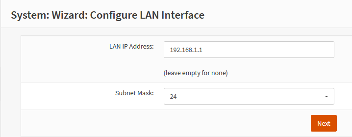

**Updated 2023-09-19:** added my VLAN setup, Xiaomi troubleshooting

In 2021, I bought a Synology DS912+ as my storage needs expanded. Little did I
know, this started me down a longer path of home automation and networking.
Since then my home network has grown in devices and complexity.

One of the items on my home network improvement list was to replace my existing
router[^1] with a home built one for the many benefits of having your own
router: security, fun, and performance (mostly in that order!). I had already
installed DD-WRT and removed the wifi antennas my existing router after
switching over to some Ubiquiti access points, since our wifi coverage was not
great. But I was hungry for more control and visiblity into WTF was going on in
my home network.

This article is mostly to document my journey setting up OPNsense, which has
achieved all my goals and more. Hopefully this it will be useful for someone
else too. I've tried to keep it as generic as possible.

Main goal is to get started using OPNsense, then build on top with cool
features like firewalls, traffic shaping, VLANs, WireGuard, etc. I've linked to
some guides for these more advanced features later. The great thing with
OPNSense is that you don't need all the bells and whistles to get started. The
default configuration is great, and you can build on it over the coming weeks
and months.

Below is a crudely drawn, high-level diagram of my [router on a
stick](https://en.wikipedia.org/wiki/Router_on_a_stick) setup.

Note: This guide is **heavily** inspired by Michael Schnerring's excellent post
on the same [here][schnerring-1]. I simply wanted a copy for my own
configuration.

## Hardware

I'll keep this section short since there are an abundance of options to pick
from. As long as you pick a x64-based CPU, OPNSense will run on it. Take a look
at the official hardware sizing page [here][opnsense-hardware].

You'll need at least 2 network ports (NICs) on the device.

### Platform

In my case, I picked up an Queensland (Australia) government-used [HP EliteDesk
G3 800][g3] with an Intel i5-6500 for AUD $169 on eBay. I had
some old laptop RAM laying around and upgraded the memory from 8GB to 16GB,
too, along with a 1 TB M.2 SSD. Mostly because and I had them laying around
unused in a drawer.

### NIC

The EliteDesk G3 800 has an A+E keyed M.2 slot, normally used by wifi cards.
Mine didn't come with one so it was free (see picture below). It's only
recently that I learned this slot can actually be used for [heaps of
purposes][m.2], one of which is as a network card!

Most people recommend Intel NICs, but I couldn't find an A+E key'ed M.2 Intel
NIC delivered cheaply here in Australia, so I ended up getting a Realtek
RTL8125 chip from AliExpress.

To get this NIC working, I needed to install the `os-realtek-re` plugin via 
System ‣ Firmware ‣ Plugins. I used the onboard Intel NIC meantime.

## OPNSense Overview

The main router/firewall firmware options are: pfSense, and OPNsense. OPNSense
is a fork of pfSense and seems to be updated more often, and have a nicer GUI.
Both are FreeBSD-based.

In my case, I will be implementing this in the "Router on a Stick"
configuration, since this machine only has two NICs. This guide is based on
OPNsense `23.7.3`.

### WAN

As far as WAN goes, my setup is very simple and the same for most home networks:

- DHCP WAN from a single Internet Service Provider (ISP)

It will likely be the same for you, unless you're running a business or some
other esoteric setup.

### LAN

The local network will be segratated up into multiple subnetworks in order to
shield devices from each other by logical function. For example, preventing
cameras from connecting to the internet. This will be implemented by appling
firewall rules on these VLANs. The LAN network itself will act as the
management network, with access to all the VLAns.

These subnetworks, or VLANs, mainly following Home
Network Guy's guide [here][hng-opnsense]. You can create more or less than
this, but I think this nicely organises most devices that are on home network:

| VLAN tag | VLAN description | Purpose                                                                                                                                                                                                                                                                           |
| --       | --               | --                                                                                                                                                                                                                                                                                |
| 10       | DMZ              | Anything exposed to the Internet, such as web servers or VPN gateways. You may not need this if you have no incoming connections.                                                                                                                                                 |
| 20       | USER             | PCs, laptops, phones isolated from IoT devices                                                                                                                                                                                                                                    |
| 30       | IOT              | IoT (Internet of Things) devices to protect other networks. I'll put any dubious devices that don't need access to rest of the internal network here. Nintendo Switches, Kindles, Air Purifiers, etc.                                                                             |
| 40       | GUEST            | Guest network for visitors and untrusted devices. No acess to other local networks.                                                                                                                                                                                               |
| 50       | IPCAM            | Isolated network for cameras                                                                                                                                                                                                                                                      |
| 60       | WFH              | A work-from-home VLAN where my work laptop will live by itself, for use when I'm working from home. This will ensure the connection stays stable, if I mess up firewall rules after a long night, and ensures it's isolated from all other devices.                               |

For each row above, navigate to Interfaces ‣ Other Types ‣ VLAN and create a
VLAN with attributes for the row using the orange `+` button.

|                       |                            |
| --                    | --                         |
| Device | Leave empty to auto-generate                 |
| Parent | Select the port that carries your local network, typically the `LAN` port. For me, this is `re0`, which will be parent interface for all VLANs. You can also a [LAGG], which is more advanced and requires a free interface. Home Network Guys uses this in his guide [here][hng-opnsense] |
| VLAN tag | See above table |
| VLAN priority | Leave as default `Best Effort` |
| Description | See above table |

Creating these VLANs should end you up with VLANs as per:

Done! We will set them up with interfaces, firewall rules, and DHCP for each of
these VLANs below.

### DNS Services

We'll use Unbound as a recursive DNS resolver for two Adguard Home instances
(one being a replica), sending DNS-over-TLS requests to Cloudflare's
[`1.1.1.1`](https://1.1.1.1) service.

## Setup Wizard

Once OPNsense is installed and running, it will be available on the network at
<https://192.168.1.1>. Your browser may give you a certificate warning, since
it uses a self-signed certificate. Hit trust and you should be greeted with a
login page.

Use the default credentials here. You'll change the password in the next steps.

- Username: `root`
- Password: `opnsense`

And you'll be greeted with the first-time setup wizard. This can also be
repeated at any time via System ‣ Wizard.

### General Information

Leave the DNS settings blank, we'll configure them later. I also prefer to use
my own DNS servers rather than my ISPs (for improved privacy and performance),
so I leave `Allow DNS servers to be overridden by DHCP/PPP on WAN` unchecked.

After each of these steps, don't forget to click "Apply".

|                       |                            |
| --                    | --                         |
| Hostname              | `OPNsense`                 |
| Domain                | `local.martinbjeldbak.com` pick something for your domain. Can be changed later so no stress |
| Enable Resolver       | checked                    |
| Enable DNSSEC Support | checked                    |
| Harden DNSSEC data    | checked                    |

### Time Server Information

|                       |                                                                                                                                                                                                 |
| --                    | --                                                                                                                                                                                              |
| Time server hostname  | `0.au.pool.ntp.org 1.au.pool.ntp.org 2.au.pool.ntp.org 3.au.pool.ntp.org` I'm in Australia, so I use the `au` pool servers. Check yours [here][ntp-zones], or use the [global][ntp-global] zone |
| Timezone              | `Australia/Melbourne` select your timezone                                                                                                                                                                           |

### Configure WAN Interface

In most cases, you will want to leave the Configuration Type on DHCP, as your
WAN interface will be issued an IP from your ISP's DHCP server.

Ensure you have the following checked at the bottom

|                                |          |
| --                             | --       |
| Block RFC1918 Private Networks | Checked  |
| Block bogon networks           | Checked  |

This will just ensure nothing shady comes in from the internet.

### Configure LAN Interface

|                                |                                                                               |
| --                             | --                                                                            |
| LAN IP Address                 | `192.168.1.1`                                                                 |
| Subnet Mask                    | `24` allows for splitting into further subnets while still reserving many IPs |

### Set Root Password

Pick a strong one here and save it in your password manager. We'll be creating
a non-root user in the next steps.

## General Settings

Browse to System ‣ Settings ‣ Administration

Most things here are left default except for the below settings

| Secure Shell        |         |
| --                  | --      |
| Secure Shell Server | checked |

| Authentication |                                                                             |
| --             | --                                                                          |
| Sudo           | `Ask password` admin users can request sudo with the help of their password |

### Create a new non-root user for admin

Browse to System ‣ Access ‣ Users

Click the orange `+` button at the top right to create a new user that will be
used as your admin user going forward.

|                   |                                                                    |
| --                | --                                                                 |
| Username          | Your username                                                      |
| Password          | Generate one and save in your password manager                     |
| Login shell       | `/bin/csh`                                                         |
| Group Memberships | `admins` make sure user is a "Member Of" this group                |
| Authorized keys   | Paste your SSH publickey here. This will be checked for SSH access |

### Misc

Browse to System ‣ Settings ‣ Miscellaneous

| Cryptography settings |        |                                                                                      |
| --                    | --     | --                                                                                   |
| Hardware acceleration | `None` | Leaving this as `None` should autoselect the appropriate hardware accellaration chip |

| Thermal Sensors |            |                                               |
| --              | --         | --                                            |
| Hardware        | `coretemp` | Select `amdtemp` if you have an AMD processor |

| Power Savings |            |                                               |
| --              | --         | --                                            |
| Use PowerD | Checked | Click the info button more on each of the settings you can pick |
| On AC Power Mode | `Hiadaptive` | This will give your CPU more juice but consume a bit more power. I'm using a miniPC so I'm ok with this.  

| Disk / Memory Settings |            |                                                                                               |
| --                     | --         | --                                                                                            |
| Swap file              | Checked    | In case your system needs to use swap, this is good to enable if you have the storage for it. |

## VLANs

Now that the VLANs have been created, we need to assign them to an interface.

Navigate to Interfaces ‣ Assignments and create a new interface by clicking on
the orange `+` next to the "New interface" row.

For each VLAN we created, select it in the dropdown and create a new interface
with the description identical to the VLAN name, i.e. `DMZ`, `USER`, etc. Then click `Save`.

On this page, The WAN and LAN interfaces should already be assigned, we'll
leave them as is.

When complete, it should include the following new interfaces

| Interface | Network port |
| --        | --           |
| DMZ       | vlan01 DMZ   |
| GUEST     | vlan04 GUEST |
| IOT       | vlan03 IOT   |
| IPCAM     | vlan05 IPCAM |
| USER      | vlan02 USER  |
| WFH       | vlan06 USER  |

In screenshot form:

Each of these interface will have its own page under the "Interfaces" menu on the left.

### VLAN IPs

We will configure each VLAN network such that the VLAN tag is in the third
octet of the address IP, in order to easily remember which network is which
VLAN. For example, the `USER` VLAN with tag **20** will have the address
192.168.1.**20**/24.

### VLAN Interfaces

For each of the interfaces we created, we will configure them independently by
clicking on each in the left-hand sidebar under "Interfaces". They'll be titled
`[DMZ]`, `[GUEST]`, and so on.

#### Interface: DMZ

Select the `[DMZ]` interface and configure it as follows

| | |
| -- | -- |
| Enable interface | Checked |
| Prevent interface removal | Checked |
| IPv4 Configuration Type | Select `Static IPv4` |
| IPv4 Address | `192.168.10.1`, select `24` |

Click "Apply changes".

#### Interface: USER

Select the `[USER]` interface and configure it as follows

| | |
| -- | -- |
| Enable interface | Checked |
| Prevent interface removal | Checked |
| IPv4 Configuration Type | Select `Static IPv4` |
| IPv4 Address | `192.168.20.1`, select `24` |

Click "Apply changes".

#### Interface: IOT

Select the `[IOT]` interface and configure it as follows

| | |
| -- | -- |
| Enable interface | Checked |
| Prevent interface removal | Checked |
| IPv4 Configuration Type | Select `Static IPv4` |
| IPv4 Address | `192.168.30.1`, select `24` |

Click "Apply changes".

#### Interface: GUEST

Select the `[GUEST]` interface and configure it as follows

| | |
| -- | -- |
| Enable interface | Checked |
| Prevent interface removal | Checked |
| IPv4 Configuration Type | Select `Static IPv4` |
| IPv4 Address | `192.168.40.1`, select `24` |

Click "Apply changes".

#### Interface: IPCAM

Select the `[IPCAM]` interface and configure it as follows

| | |
| -- | -- |
| Enable interface | Checked |
| Prevent interface removal | Checked |
| IPv4 Configuration Type | Select `Static IPv4` |
| IPv4 Address | `192.168.50.1`, select `24` |

Click "Apply changes".

#### Interface: WFH

Select the `[WFH]` interface and configure it as follows

| | |
| -- | -- |
| Enable interface | Checked |
| Prevent interface removal | Checked |
| IPv4 Configuration Type | Select `Static IPv4` |
| IPv4 Address | `192.168.60.1`, select `24` |

Click "Apply changes".

### VLAN Interface DHCP

For each of the VLANs just created, I recommend enabling DHCP, unless you want
to assign each device an IP manually, which may be feasible for smaller
networks, such as the `IPCAM` or `GUEST` VLANs.

To enable DHCP for each VLAN, we repeat the following. Again, this is all up to
you, but I use the range `x.x.x.10-99` range for static, and `x.x.x.100-199`
for dynamic IP assignments.

You can add static DHCP reservations in the Services ‣ DHCPv4 ‣ Leases page,
where you can assign a static IP for each MAC address. This is my preferred way
of managing all my devices, as otherwise you will need to manually type in MAC addresses.

Browse to Services ‣ DHCPv4.

#### DHCP: DMZ

Select the `[DMZ]` interface and configure it as follows

| | |
| -- | -- |
| Enable | Checked |
| Range | `192.168.10.100` to `192.168.10.199` |

Click "Save".

#### DHCP: USER

Select the `[USER]` interface and configure it as follows

|        |                                      |
| --     | --                                   |
| Enable | Checked                              |
| Range  | `192.168.20.100` to `192.168.20.199` |

Click "Save".

#### DHCP: IOT

Select the `[IOT]` interface and configure it as follows

|        |                                      |
| --     | --                                   |
| Enable | Checked                              |
| Range  | `192.168.30.100` to `192.168.30.199` |

Click "Save".

#### DHCP: GUEST

Select the `[GUEST]` interface and configure it as follows

|        |                                      |
| --     | --                                   |
| Enable | Checked                              |
| Range  | `192.168.40.100` to `192.168.40.199` |

Click "Save".

#### DHCP: IPCAM

Select the `[IPCAM]` interface and configure it as follows

|        |                                      |
| --     | --                                   |
| Enable | Checked                              |
| Range  | `192.168.50.100` to `192.168.50.199` |

Click "Save".

#### DHCP: WFH

Select the `[WFH]` interface and configure it as follows

|        |                                      |
| --     | --                                   |
| Enable | Checked                              |
| Range  | `192.168.60.100` to `192.168.60.199` |

Click "Save".

## Firewall Settings

Browse to Firewall ‣ Settings ‣ Advanced

| IPv6 Options |           |
| --           | --        |
| Allow IPv6   | Unchecked |

I don't yet want to support IPv6 on my network (I'm lazy).

| Gateway Monitoring |           |
| --                 | --        |
| Skip rules         | Checked   |

| Miscellaneous |           | | 
| --           | --        | -- | 
| Firewall Optimization | `conservative` | Mainly got this idea from Michal Schnerring's guide [here][schnerring-2]. We have a powerful machine, avoid dropping idle connections at expense of increased memory and CPU usage. |
| Firewall Maximum Table Entries | `2000000` | We have heaps of memory, this will be fine. |
| Disable anti-lockout | checked | Will be manually defined later |

## Checksum Offloading

Some hardware does not support checksum offloading, especially Realtek cards like mine.

Browse to Interfaces ‣ Settings

| Network Interfaces    |           |
| --                    | --        |
|  Hardware CRC         | Unchecked |

Rest are checked.

## DNS

For DNS, I'm using two instances [Adguard Home] hosted on the network: one on
the OPNSense box (see installation guide [here][adguard-setup]), another on my
NAS, installed via the Docker image. I use these for DNS blocklist filtering,
internal DNS resolution and lookup, and will configure them both to use
OPNSense's Unbound server as the upstream DNS resolver.

Unbound has support for DNS-over-TLS (DoT), which I prefer to use to enhance
privacy as DNS lookups can't be man-in-the-middle attacked. Using [DNS over
TLS](https://www.cloudflare.com/learning/dns/dns-over-tls/), our DNS queries
are sent encrypted over the wire to the DNS provider. I prefer to use
Cloudflare, but there are other DoT services around.

Below is a rough diagram of how we'll setup Unbound as a recursive DNS resolver
for Adguard Home.

You may want your setup to be slightly different, running pi-hole, or not using
a replica. This is totally up to you.

### Unbound (DNS Resolver)

First, let's configure Unbound, and then point our Adguard Home instances to
this Unbound service.

Browse to Services ‣ Unbound DNS ‣ General

|                               |                                                                                                              | Comment                                                                                                                                                                                        |
| --                            | --                                                                                                           | --                                                                                                                                                                                             |
| Enable Unbound                | Checked                                                                                                      |                                                                                                                                                                                                |
| Listen Port                   | `5354`                                                                                                       | We install the `os-adguard` plugin which will run on port `53` and use Unbound as its upstream DNS.                                                                                            |
| Network Interfaces            | `All`                                                                                                        |                                                                                                                                                                                                |
| Register DHCP Leases          | Checked                                                                                                      | If you want to be able to resolve hostnames of PCs rather than connecting to them using IPs                                                                                                    |
| Register DHCP Static Mappings | Checked                                                                                                      | Any static DHCP mappings will have entires for their hostnames                                                                                                                                 |
| Flush DNS Cache during reload | Checked                                                                                                      | We pay a small performance cost when reloading Unbound, but DNS issues are really hard to debug, so worth it when we are making Unbound configuration changes, which is not very often.        |

Browse to Services ‣ Unbound DNS ‣ Advanced

| | |
| -- | -- |
| Hide Identity  | Checked |
| Hide Version | Checked |
| Prefetch DNS Key Support | Checked |
| Harden DNSSEC Data | Checked |
| Prefetch Support | Checked |

Browse to Services ‣ Unbound DNS ‣ DNS over TLS

Under `Custom forwarding`, click the orange `+` button

| | |
| -- | -- |
| Server IP | `1.1.1.1` |
| Server port | `853` |
| Verify CN | `cloudflare-dns.com` |

And we'll add another one for fallback.

|             |                      |
| --          | --                   |
| Server IP   | `1.0.0.1`            |
| Server port | `853`                |
| Verify CN   | `cloudflare-dns.com` |

### Adguard Home configuration

Now we'll switch to Adguard Home and configure it to use our newly configured Unbound
server.

Adguard Home is assumed to be running on your network already. If not,
no worries! You can easily install Adguard Home as a process on your OPNSense
box or via a docker container.

We'll be using Adguard Home, but this is also valid for any other DNS server,
such as Pi-Hole. I like the UI and simplicity of Adguard Home.

Browse to Settings ‣ DNS settings

In section `Upstream DNS servers`

- Add `192.168.1.1:5354`, and delete any that exist

In section `Bootstrap DNS servers`

- Add `192.168.1.1:5354`, and delete any that exist

In section `Private reverse DNS servers`

- Add `192.168.1.1:5354`, and delete any that exist

## Firewall

Note that these settings may be configured slightly differently for your
configuration and needs. OPNSense's powerful firewall is the major strength of
OPNSense and one of the major reasons why I switched - something the Netgear
and DD-WRT router configurations are sorely missing.

At a high level, the goal is to:

- Allow internet access through WAN
- Allow intranet communication
- Redirect all DNS traffic to Adugard Home
- Redirect NTP traffic to OPNSense
- Block malicious IP's

### Aliases

Before we start to configure the firewall, it will help to define some OPNSense
[aliases]. Aliases are really flexible and can be defined for anything from IPs
you normally use, to a list of countries! They can then be referenced in
firewall rules in order to provide clearer intent and ability to update.
URL-list based aliases are especially powerful, as we'll see when setting up
IP-based blocklisting.

Below is a snapshot of a couple of my aliases

Browse to Firewall ‣ Alises and create the following aliases using the orange `+` button.

#### Private Networks

We will group all private CIDR ranges in one group in order to simplify
firewall rules. This will also help us in the future if we create any new
networks as they will be apart of this group.

|             |                                                           |
| --          | --                                                        |
| Enabled     | Checked                                                   |
| Name        | `PrivateNetworks`                                         |
| Type        | `Network(s)`                                              |
| Content     | `10.0.0.0/8`, `172.16.0.0/12`, `192.168.0.0/16` (RFC1918) |
| Description | `All local networks`                                      |

#### Admin / Anti-lockout Ports

|             |                                          |
| --          | --                                       |
| Name        | `ports_anti_lockout`                     |
| Type        | `Port(s)`                                |
| Content     | `443` (OPNSense HTTPS port) `22` (SSH)   |
| Description | `OPNsense anti-lockout ports`            |

#### IP Blocklists

Many IP blocklists exist on the internet, below I'll outline a couple of the
ones I use. Feel free to mix and match and find your own. They're added as an extra
layer of security on top of DNS filtering with Adguard Home.

|             |                                                                                                                                   |
| --          | --                                                                                                                                |
| Name        | `BL_spamhaus_drop`                                                                                                                |
| Type        | `URL Table (IPs)`                                                                                                                 |
| Content     | `https://www.spamhaus.org/drop/drop.txt`, `https://www.spamhaus.org/drop/edrop.txt`, `https://www.spamhaus.org/drop/dropv6.txt`  |
| Description | `Blocklist Spamhaus drop`                                                                                                         |

See details on these lists [here](https://www.spamhaus.org/drop/).

|             |                                                                                                                                   |
| --          | --                                                                                                                                |
| Name        | `BL_cisco_talos`                                                                                                                |
| Type        | `URL Table (IPs)`                                                                                                                 |
| Content     | `http://www.talosintelligence.com/documents/ip-blacklist` |
| Description | `Blocklist CISCO Talos`                                                                                                         |

See details on this list [here](https://www.allthingstech.ch/using-opnsense-and-ip-blocklists-to-block-malicious-traffic).

|             |                                                                                                                                   |
| --          | --                                                                                                                                |
| Name        | `BL_cins_army`                                                                                                                |
| Type        | `URL Table (IPs)`                                                                                                                 |
| Content     | `https://cinsarmy.com/list/ci-badguys.txt` |
| Description | `Blocklist CINS army`                                                                                                         |

See details on this list [here](https://cinsarmy.com/list-download/).

#### NAS alias

This will be specific to your use case, but I have a Synology NAS that will be
on the `DMZ` network, which we will want to access from our other networks. It
will help in our firewall rules if we create a Firewall Alias to this host so
we can refer to the alias instead of the IP, meaning we can move the device to
a different network or IP in the future without having to update our firewall
rules.

|             |                                                                                                                                   |
| --          | --                                                                                                                                |
| Name        | `NAS`                                                                                                                |
| Type        | `Host(s)` |
| Content     | `192.168.10.10` an IP on the DMZ network |
| Description | `Synology NAS`                                                                                                         |

### Rules

Browse to Firewall ‣ Rules

#### Anti-lockout

The first rule we should add is the anti-lockout rule. As since we disabled that
in the settings, we don't want to risk preventing access to the device in case
we screw up any of the following rules!

Browse to Firewall ‣ Rules ‣ Floating and click the orange `+` to add

|                        |                      |
| --                     | --                   |
| Action                 | `Pass`               |
| Interface              | `LAN`                |
| Protocol               | `TCP/UDP`            |
| Destination            | `This Firewall`      |
| Destination port range | `ports_anti_lockout` |
| Description            | `Anti-lockout`       |

#### Rules: Isolate LAN from other VLANs

The untagged LAN network will act as the management network, where all critical
network infrastructure is managed.

The below rules, we will allow access to the internet, and only ping access to
the other VLANs. if you want to allow any hosts in the LAN network to reach
anything specific in any other networks, add another rule above the last rule.

|                                   |                                               |
| --                                | --                                            |
| Interface                         | `LAN`                                         |
| TCP/IP Version                    | `IPv4+6`                                      |
| Protocol                          | `TCP/UDP`                                     |
| Source                            | `LAN net`                                     |
| Destination / Invert              | Unchecked                                     |
| Destination                       | `LAN address`                                 |
| Destination port range            | `DNS`                                         |
| Description                       | `Allow access to DNS`                         |

|                                   |                                               |
| --                                | --                                            |
| Interface                         | `LAN`                                         |
| TCP/IP Version                    | `IPv4`                                      |
| Protocol                          | `ICMP`                                     |
| Source                            | `LAN net`                                     |
| Destination / Invert              | Unchecked |
| Destination                       | `any` |
| Destination port range            | `any`                                         |
| Description                       | `Allow ICMPv4 from LAN to all networks`   |

The above rule will help debugging issues as you'll be able to ping all hosts
from the LAN network, along with using other tools. You can chose not to enable
this.

|                                   |                                               |
| --                                | --                                            |
| Interface                         | `LAN`                                         |
| TCP/IP Version                    | `IPv4+6`                                      |
| Protocol                          | `any`                                     |
| Source                            | `LAN net`                                     |
| Destination / Invert              | Checked |
| Destination                       | `PrivateNetworks` |
| Destination port range            | `any`                                         |
| Description                       | `Allow allow access only to internet`   |

Click "Apply changes".

#### Rules: DMZ network

This network's purpose is similar to LAN, so these rules will be similar in that
we will isolate it from all other networks, meanwhile allowing access to the internet.

The purpose of the DMZ is to limit exposure to local network in case any public
facing services are compromised, meaning I would not recommend allowing the DMZ
to access anything inside the internal network.

|                                   |                                               |
| --                                | --                                            |
| Interface                         | `DMZ`                                         |
| TCP/IP Version                    | `IPv4+6`                                      |
| Protocol                          | `TCP/UDP`                                     |
| Source                            | `DMZ net`                                     |
| Destination / Invert              | Unchecked                                     |
| Destination                       | `DMZ address`                                 |
| Destination port range            | `DNS`                                         |
| Description                       | `Allow access to DNS`                         |

|                                   |                                               |
| --                                | --                                            |
| Interface                         | `DMZ`                                         |
| TCP/IP Version                    | `IPv4+6`                                      |
| Protocol                          | `any`                                     |
| Source                            | `DMZ net`                                     |
| Destination / Invert              | Checked |
| Destination                       | `PrivateNetworks` |
| Destination port range            | `any`                                         |
| Description                       | `Allow allow access only to internet`   |

#### Rules: USER network

The purpose of the user network is to contain PCs, laptops, and phones (phones
could also be in the IOT network). We want to separate these devices from the
vulnerable IOT devices. Rules below will be similar.

|                                   |                                               |
| --                                | --                                            |
| Interface                         | `USER`                                         |
| TCP/IP Version                    | `IPv4+6`                                      |
| Protocol                          | `TCP/UDP`                                     |
| Source                            | `USER net`                                     |
| Destination / Invert              | Unchecked                                     |
| Destination                       | `USER address`                                 |
| Destination port range            | `DNS`                                         |
| Description                       | `Allow access to DNS`                         |

|                                   |                                               |
| --                                | --                                            |
| Interface                         | `USER`                                         |
| TCP/IP Version                    | `IPv4`                                      |
| Protocol                          | `TCP`                                     |
| Source                            | `USER net`                                     |
| Destination / Invert              | Unchecked                                     |
| Destination                       | `NAS`                                 |
| Destination port range            | `HTTPS`                                         |
| Description                       | `Allow access to NAS`                         |

|                                   |                                               |
| --                                | --                                            |
| Interface                         | `USER`                                         |
| TCP/IP Version                    | `IPv4+6`                                      |
| Protocol                          | `any`                                     |
| Source                            | `USER net`                                     |
| Destination / Invert              | Checked |
| Destination                       | `PrivateNetworks` |
| Destination port range            | `any`                                         |
| Description                       | `Allow allow access only to internet`   |

#### Rules: IOT network

The purpose of this network is to put less trusted IoT (Internet of Things)
devices such as smart light bulbs, air purifiers, etc. These devices are
notorious for not receiving updates and being vulnerable to many different
attacks.

|                                   |                                               |
| --                                | --                                            |
| Interface                         | `IOT`                                         |
| TCP/IP Version                    | `IPv4+6`                                      |
| Protocol                          | `TCP/UDP`                                     |
| Source                            | `IOT net`                                     |
| Destination / Invert              | Unchecked                                     |
| Destination                       | `IOT address`                                 |
| Destination port range            | `DNS`                                         |
| Description                       | `Allow access to DNS`                         |

|                                   |                                               |
| --                                | --                                            |
| Interface                         | `IOT`                                         |
| TCP/IP Version                    | `IPv4+6`                                      |
| Protocol                          | `any`                                     |
| Source                            | `IOT net`                                     |
| Destination / Invert              | Checked |
| Destination                       | `PrivateNetworks` |
| Destination port range            | `any`                                         |
| Description                       | `Allow allow access only to internet`   |

#### Rules: GUEST network

The purpose of the guest network is to have the in laws nicely separated when
they come visit and use your Wifi. They can bring all sorts of devices, which
may stay longer than you expect! That's what the `GUEST` network is for -
untrusted devices.

|                                   |                                               |
| --                                | --                                            |
| Interface                         | `GUEST`                                         |
| TCP/IP Version                    | `IPv4+6`                                      |
| Protocol                          | `TCP/UDP`                                     |
| Source                            | `GUEST net`                                     |
| Destination / Invert              | Unchecked                                     |
| Destination                       | `GUEST address`                                 |
| Destination port range            | `DNS`                                         |
| Description                       | `Allow access to DNS`                         |

|                                   |                                               |
| --                                | --                                            |
| Interface                         | `GUEST`                                         |
| TCP/IP Version                    | `IPv4+6`                                      |
| Protocol                          | `any`                                     |
| Source                            | `GUEST net`                                     |
| Destination / Invert              | Checked |
| Destination                       | `PrivateNetworks` |
| Destination port range            | `any`                                         |
| Description                       | `Allow allow access only to internet`   |

#### Rules: IPCAM network

This network is for your IP and network security cameras that you definitely
don't want calling home or streaming to the internet. So for this network,
we'll only allow access to DNS. Every other connection will be blocked.

|                                   |                                               |
| --                                | --                                            |
| Interface                         | `IPCAM`                                         |
| TCP/IP Version                    | `IPv4+6`                                      |
| Protocol                          | `TCP/UDP`                                     |
| Source                            | `IPCAM net`                                     |
| Destination / Invert              | Unchecked                                     |
| Destination                       | `IPCAM address`                                 |
| Destination port range            | `DNS`                                         |
| Description                       | `Allow access to DNS`                         |

#### Rules: WFH Network

This VLAN will is identical to the IOT network, with only DNS and internet
access allowed, and no cross-VLAN boundary access.

#### Forwarding rule: Redirect NTP Traffic to OPNSense's NTP server

Browse to Firewall ‣ Rules ‣ NAT ‣ Port Forward and add the following rule

|                                   |                                               |
| --                                | --                                            |
| Interface                         | `LAN`                                         |
| Protocol                          | `TCP/UDP`                                     |
| Source                            | `LAN net`                                     |
| Destination / Invert              | Checked                                       |
| Destination                       | `LAN net`                                     |
| Destination port range            | `NTP`                                         |
| Redirect target IP                | `127.0.0.1`                                   |
| Redirect target port              | `NTP`                                         |
| Description                       | `Redirect outbound NTP traffic to OPNSense`   |

#### Set up IP-based Blocklists

For each of the blocklist-based alises defined earlier, we will create a rule
to block requests to and from any IPs in this list, i.e. requests will be
blocked in **any** direction. Inbound requests are blocked by default in
OPNsense, so this will mostly ensure any devices on our network don't call to
vulnerable/suspicious IPs either intentionally or accidentally.

Browse to Firewall ‣ Rules ‣ Floating and add the following rules

|                        |                                                   |
| --                     | --                                                |
| Action                 | `Block`                                           |
| Interface              | `LAN,WAN`                                         |
| Direction              | `any`                                             |
| TCP/IP Version         | `IPv4+IPv6`                                       |
| Destination            | `BL_spamhaus_drop`                                |
| Log                    | Checked                                           |
| Description            | `BL Spamhaus drop`                                |

|                        |                                  |
| --                     | --                               |
| Action                 | `Block`                          |
| Interface              | `LAN,WAN`                        |
| Direction              | `any`                            |
| TCP/IP Version         | `IPv4+IPv6`                      |
| Destination            | `BL_cisco_talos`                 |
| Log                    | Checked                          |
| Description            | `BL CISCO Talos drop`            |

|                        |                                  |
| --                     | --                               |
| Action                 | `Block`                          |
| Interface              | `LAN,WAN`                        |
| Direction              | `any`                            |
| TCP/IP Version         | `IPv4+IPv6`                      |
| Destination            | `BL_cins_army`                   |
| Log                    | Checked                          |
| Description            | `BL CINS Army drop`              |

That's it for the firewall rules. I have also set up port forwarding for
WireGuard and Plex in order to support streaming and remote VNP clients,
respectively.

### Cloud Backup

Don't skip this one! There are many ways to back up the router configuration.
I've chosen to backup settings to Google Drive, simply as it's easiest. In the
future, I'll consider backing up using `git`.

See the [official docs](https://docs.opnsense.org/manual/how-tos/cloud_backup.html) for backup to
Google Drive or Nextcloud. I've followed the Google Drive route and it's
working great.

## Troubleshooting

### mDNS Repeater

Installing a multicast DNS (mDNS) repeater can help when using VLANs and you
have devices across them that make use of mDNS, such as Apple Airplay and
Chromecast products. In my case, Home Assistant is running in the `DMZ` VLAN,
with an Apple TV in the `USER` VLAN. They will be unable to communicate without
mDNS.

Luckily for us, OPNSense has a plugin that can help repeat mDNS packets across
interfaces. To get set up, install the `os-mdns-repeater` plugin under System ‣
Firmware ‣ Plugins.

Then reload the page, select the desired networks, and enable it. Pretty simple!

I spent way too many hours tracking this one down wondering why my Homekit
integration in Home Assistant wasn't working! Don't forget to add firewall
rules allowing access to the mDNS port `5353` from each of the VLANs.

### Home Assistant: Enable Access to Xiaomi Products

If you, like me, have a Xiaomi product and wish to put it in a separate `IOT`
network, you may have troubles accessing it from another VLAN. This is
documented
[here](https://python-miio.readthedocs.io/en/latest/troubleshooting.html#discover-devices-across-subnets)
in the `python-miio` Python library that the Home Assistant [Xiaomi
Miio](https://www.home-assistant.io/integrations/xiaomi_miio/) integration
uses. In my case, I have a Xiaomi Air Purifier 3H which kept giving me
connection error, even when it was fully accessible from the Xiaomi Mi app, and
firewall logs show an initially successful request to `<purifier.ip:54321>`.

The root cause of this is apparently either a bug og security feature within
Xiaomi devices, where they will not action a UDP packet if it does not belong
to the subnet of the device. In our case, we're maing a cross-subnet request
from Home Assistant, so the device drops the packet. Frustrating!

To fix this, we do as they suggest in the article and set up IP masquerading
(NAT) in OPNsense for the device. I only have one at the moment, so my setup is
very simple. If you have multiple devices, I suggest setting up some aliases.

Navigate to Firewall ‣ NAT ‣ Outbound and select the "Hybrid outbound NAT rule generation" Mode, then click Save.

Once the page has refreshed, you should see the familiar orange `+` button to add a new Manual rule. Here's what I added.

|                     |                                                                                                         |
| --                  | --                                                                                                      |
| Interface           | Select `IOT` set this to the interface where the Xiaomi device is in                                    |
| TCP/IP Version      | `IPv4`                                                                                                  |
| Protocol            | `UDP`                                                                                                   |
| Source address      | Select an alias or enter the IP of your **Home Assistant** instance here, in my case `192.168.10.10/32` |
| Source port         | `any`                                                                                                   |
| Destination address | Select an alias or enter the IP of your **Xiaomi device** here, in my case `192.168.30.10/32`           | 
| Destination port    | `any`                                                                                                   |
| Translation/target  | `Interface address` this will make the device think it's coming from the IOT device.                    |
| Description         | `Enable access to Xiaomi device cross-VLAN`                                                             |

Click "Save" and then retry connecting to the device in Home assistant, and it
should connect successfully across VLAN boundaries.

### No internet access

While testing the OPNsense setup, I added my existing router as a "gateway" in
System ‣ Gateways ‣ Single alongside the WAN one. This allowed LAN access
between hosts, but all hosts on the network were unable to connect to the
internet via the WAN gateway.

Solution: simply removing the existing router as a Gateway instantly fixed it.
I'm embarrassed it took me over an hour to figure out what was going wrong.

## Thanks

Thanks for reading! I started this journey knowing very little about home
networking, network segratation, and security best practices. Buying a cheap
second-hand computer and installing OPNSense on it has been heaps of fun, and
I've been able to secure my home network more than I could've imagined.

Both intranet and internet requests now also feel snappier, but this may just
be my brain trying to convince myself all this trouble is worth the effort...

The dashboards and logging that OPNSense provides is also really refreshing. I
check the real-time dashboards a least twice a day just to marvel at how cool
it is to see network traffic flowing 😎.

There's still a lot to do. I've linked to some of the things I have done or am
planning to do below.

Again, I can't recommend [Michael Schnerring's guide][schnerring-1] enough.
It's the basis of my setup, and his includes confirmation steps that this guide
doesn't.

Have any questions or comments? Reach out to me on
<https://twitter.com/martinbjeldbak> as I'm still undecided on how to get
comments added to posts.

### Awesome things you now can do!

So many options - here are a few I've done. I may write about this to go into further detail, but mostly I've followed these to the point.

- [Set up Adguard Home on your router][adguard-setup]. I only touched briefly on it in this article.
  - [Add DNS blocklists such as https://oisd.nl/](https://oisd.nl/)
  - [Forum guide on AdguardHome and Unbound](https://forum.opnsense.org/index.php?topic=22162.msg146626#msg146626)
- [Set up Dynamic DNS with ddclient](https://docs.opnsense.org/manual/dynamic_dns.html)
- [Set up IP blocklist to block malicious IPs](https://www.allthingstech.ch/using-opnsense-and-ip-blocklists-to-block-malicious-traffic)
  - [More lists on Reddit](https://www.reddit.com/r/pfBlockerNG/comments/9t1w6o/pfblockerngdevel_feed_feedback/)
- [Set up The Intrusion Prevention System (IPS) system for deep packet inspection](https://docs.opnsense.org/manual/ips.html)
- [Set up GeoIP for country-specific allowing/blocking](https://docs.opnsense.org/manual/how-tos/maxmind_geo_ip.html)
- [Set up your OPNSense as a Wireguard server with os-wireguard](https://docs.opnsense.org/manual/how-tos/wireguard-client.html) for VPN server on your router
- [Replace the OPNsense Web UI Self-Signed Certificate with a Let's Encrypt Certificate](https://homenetworkguy.com/how-to/replace-opnsense-web-ui-self-signed-certificate-with-lets-encrypt/)
- [Enable Traffic Shaping for improved bufferfloat handling](https://maltechx.de/en/2021/03/opnsense-setup-traffic-shaping-and-reduce-bufferbloat/) I followed this guide and increased mine from B to A! Let's see if it helps me in CS:GO 😅

### Further reading

- [Linus Tech Tips video on why you should build your own router](https://www.youtube.com/watch?v=_IzyJTcnPu8)
- [Excellent in depth guie from Home Network Guy][hng-opnsense]
  - Home Network Guy has [video version too](https://www.youtube.com/watch?v=h2_cQxTkh3Q) that covers setup from installation to many things in this post.

[hng-opnsense]: https://homenetworkguy.com/how-to/set-up-a-fully-functioning-home-network-using-opnsense/
[adguard-setup]: https://0x2142.com/how-to-set-up-adguard-on-opnsense/
[m.2]: https://www.youtube.com/watch?v=4TsJ7t7IBiw
[schnerring-1]: https://schnerring.net/blog/opnsense-baseline-guide-with-vpn-guest-and-vlan-support/
[schnerring-2]: https://schnerring.net/blog/router-on-a-stick-vlan-configuration-with-swos-on-the-mikrotik-crs328-24p-4s+rm-switch/
[self-hosted]: https://github.com/martinbjeldbak/self-hosted
[g3]: https://www.servethehome.com/hp-elitedesk-800-g3-mini-ce-review-project-tinyminimicro
[opnsense-hardware]: https://docs.opnsense.org/manual/hardware.html
[ntp-zones]: https://www.ntppool.org/zone
[ntp-global]: https://www.ntppool.org/zone/@
[Adguard Home]: https://adguard.com/en/adguard-home/overview.html
[aliases]: https://docs.opnsense.org/manual/aliases.html
[lagg]: https://docs.opnsense.org/manual/other-interfaces.html#lagg

[^1]: A Netgear Nighthawk R7000P Dual-band wifi router. One of those machines
    with everything: router, wifi (all of 3 atennas), storage
