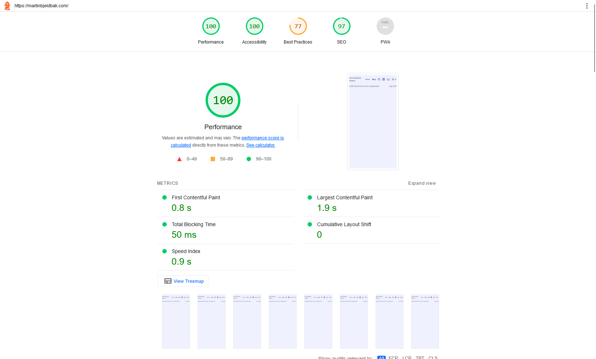
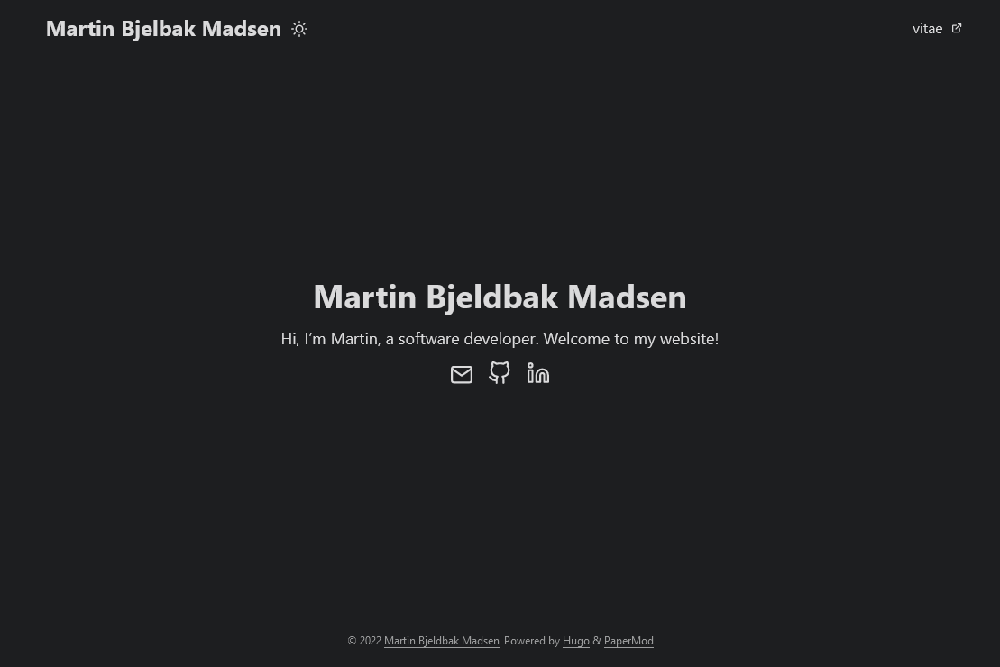

This is the first post documenting moving my site from a static-built Hugo site
with no content or blog, to [Astro]. Make no mistake: it's still (intentionally) boring.

Instead of picking a pre-built theme as with my previous setup, I've built it from
scratch as a learning experience in order to learn CSS flexbox. Everything is public on my GitHub at
[martinbjeldbak/website]. It's built with

- [Astro]
- [TailwindCSS]
- [Cloudflare Pages]
- [heroicons] and [Simple Icons] for SVG-based icons

Below are some reasonings behind the transition.

## Inspiration

Recently I've been inspired to write more publicly. I think this is due to having
written for myself the last couple of years using [Obsidian] and its daily journaling plugin,
which is now a habit that has really sunk in.

I just want a place where I can write some simple posts in markdown and publish
them to the world, mainly for myself. I'd like to look back in a couple of years
and review my public thoughts. Now I finally have it!

## Technologies

[Astro] I chose mostly due to Hugo's templating never really feeling right, and I'll admit this
great video by Fireship: [Astro just Launched.... Could it be the ultimate web framework?][1]
had me very intrigued. It has an insane amount of features that I really like,
such as file-based routing (I love Rails), natively supports rendering markdown files
with the concept of [Content Collections][2], and many other features.

Building this site, I got a chance to play with Astro [Components][3] and light/dark modes. It should
also respect the system theme if none is set. Woohoo!

I won't go into the whole setup process, as there are many guides for this. The
official Astro one is by far the best I've found. They also have a great guide
that shows everything off [here][4] which will end you up with a new blog site,
which I based this new site on, though with "Content Collections" rather than markdown layouts.

[TailwindCSS] is the hottest new tool these days, and I now
see why. I have not written a single custom class or written any manual CSS to
build this site, and I couldn't be happier. As a primarily backend developer, I've had minimal exposure to CSS, making
me a complete beginner. It only took me a couple of hours to get this site up and
running in a relatively readable state. Don't get me wrong - it's still pretty rough. I'm working on it!
As far as Tailwind component libraries are concerned, it's not needed for a simple
blog in my opinion. I find [Skeleton] really interesting. I'll likely
use it in the next side project.

[Cloudflare Pages] was also used before, so to keep changes minimal, I'll keep
deploying there. It has [native support][astrocloudflare] for deploying Astro
applications, only taking a few clicks to change from Hugo. Also, Cloudflare has great features like automatic deployments from GitHub,
but Fireship also talks a lot about [Vercel], so I'm considering this too!

## Performance

I know lighthouse doesn't mean anything in the long run, but so far so good!

## Thoughts

Building this website with simple Tailwind components and the simplicity of Astro
has been heaps of fun. Learning more CSS has always been something I've wanted to do, and what better way
than to start from simple components.

This will be a constant journey and I'll be tweaking away over the coming months
and experiment with new technologies and topics.

For reference, here's what my boring website looked like before this rewrite:

Ok Bye!

[Tailwindcss]: https://tailwindcss.com
[Astro]: https://astro.build/
[Cloudflare Pages]: https://pages.cloudflare.com/
[Obsidian]: https://obsidian.md/
[1]: https://www.youtube.com/watch?v=gxBkghlglTg
[2]: https://docs.astro.build/en/guides/content-collections/
[3]: https://docs.astro.build/en/core-concepts/astro-components/
[4]: https://docs.astro.build/en/tutorial/0-introduction/
[Skeleton]: https://www.skeleton.dev
[Vercel]: https://vercel.com/
[heroicons]: https://heroicons.com/
[Simple Icons]: https://simpleicons.org/
[martinbjeldbak/website]: https://github.com/martinbjeldbak/website
[astrocloudflare]: https://docs.astro.build/en/guides/deploy/cloudflare/
