I have a 4-bay [Synology DS920+][ds920] that I love and use for all sorts of
things, from home automation, Windows backups with Synology Drive, to linux
ISOs.

One of the things I have yet to do is set it as a target for Time Machine
backups from my Mac.

There are a couple of guides linked below that cover this, this is yet another
one! One thing most miss is how important the drive quotas are, because Time
Machine will chew up as much free storage as available on the drive, which is
far from ideal.

This guide covers how to set up backups with MacOS Time Machine to a Synology
NAS running DSM 7.2, using folder quotas.

## Steps

Most of the initial steps are similar to the [official] guide.

### Create a Shared Folder for Time Machine

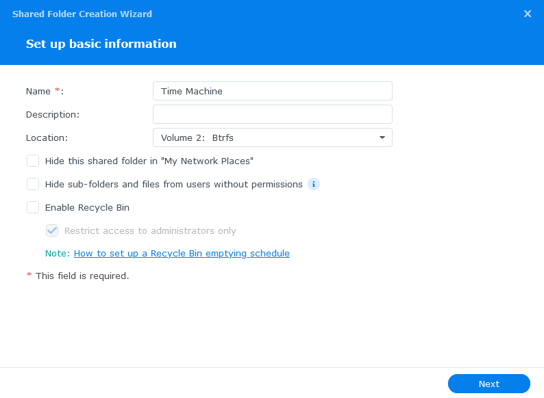

NOTE: Ensure you **disable** Recycle Bin and **disable** folder encryption, as
Time Machine itself will encrypt the backups, as we'll see below

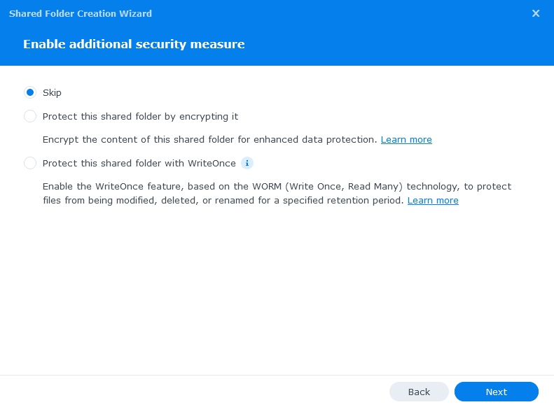

Enable any advanced settings you need. You can enable a quota here at the folder level, but I will do it on the user level.

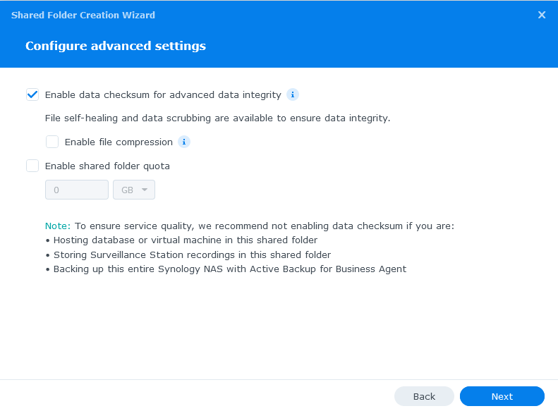

Confirm settings and hit next to create your new folder!

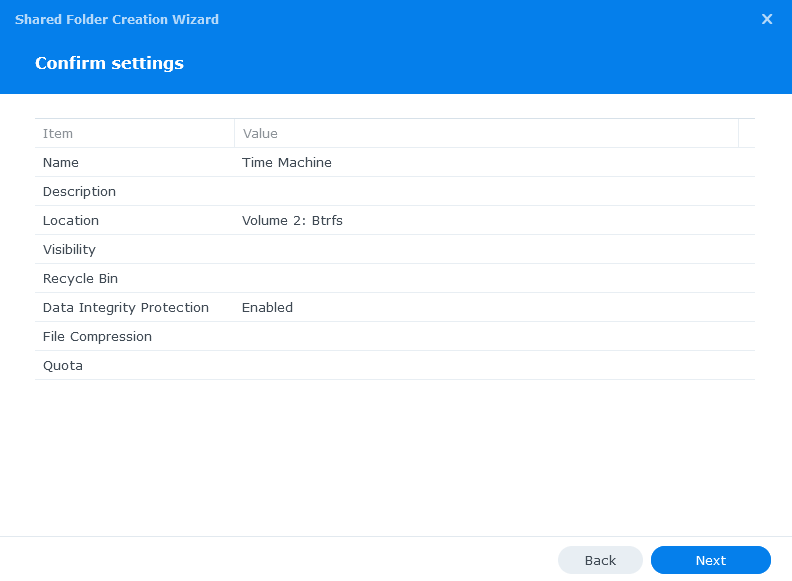

### Enable SMB service

SMB is the preferred protocol, as [AFP is deprecated][afp]. So
let's enable SMB if it's not already via **Control Panel** > **File Services**

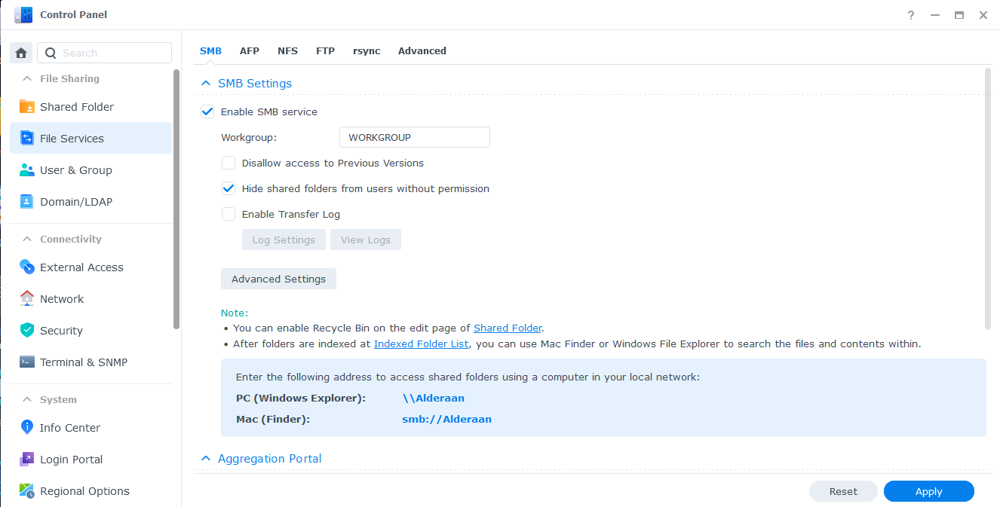

### Set up Bonjour

Next we will want to set up Bonjour to broadcast via SMB, and point to our *Time
Machine* shared folder.

In **Control Panel** > **File Services** > **Advanced tab**, ensure *Enable
Bonjour service discovery to locate Synology NAS* is ticked, along with the
checkbox *Enable Bonjour Time Machine broadcast via SMB*. Then click *Set Time
machine Folders* and select our newly created *Time Machine* shared folder

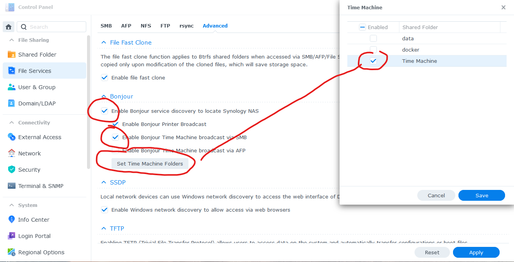

### Create user with Shared Folder quota

If you have multiple Macs you want to backup, [create a new DSM
user][create-user] account for each of them, rinse and repeat. In my case, I'll
just be creating one for myself.

Make sure you save the username and password. You'll need it when setting up
Time Machine on your Mac.
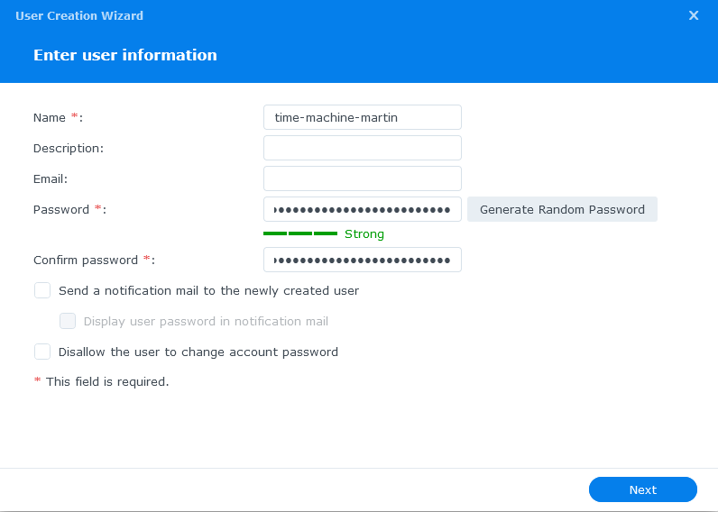

Setting of the groups and permissions may differ for you. I have a very simple
group setup, so will only keep the new user in the default Users group, and assign
permissions and quota directly on our new Shared folder.

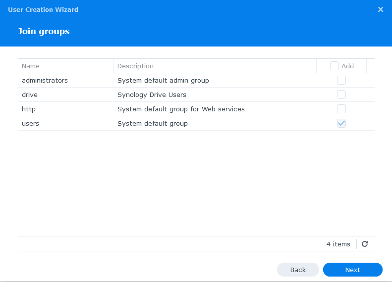
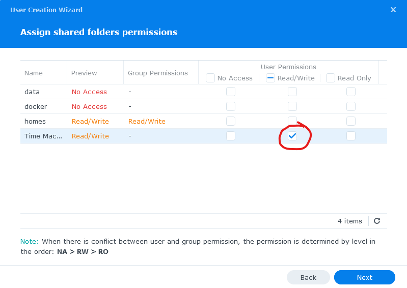

In my case, I've set a 300 GB quota on the folder. We'll see if this is enough!
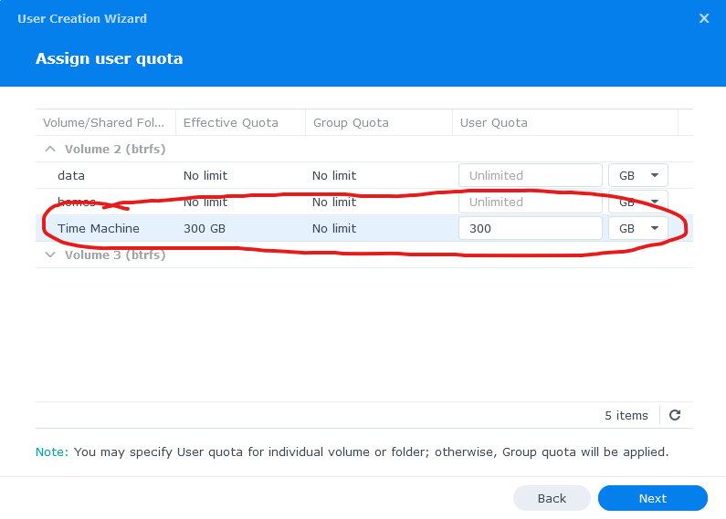

Configure any other settings on the next couple of dialog windows to finally
create the new time machine user. Repeat this for any other user accounts you need to create.

### Set up Time Machine to Synology NAS

Now on your Mac, open the **Time Machine** application by searching in spotlight, or from Applications folder in Finder. In my case, I don't have any previously defined Time Machine backup locations, so I have to configure a new backup disk.

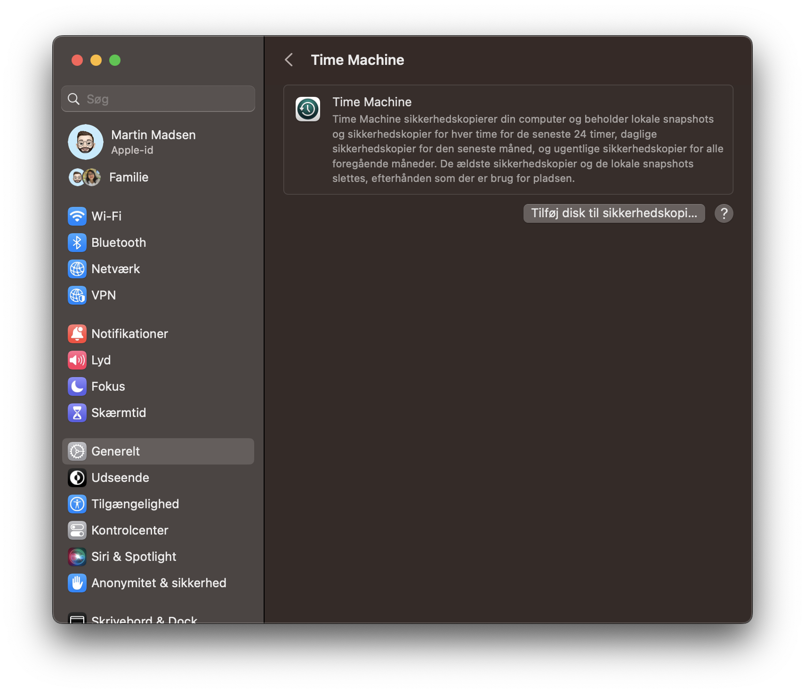

Click on **Select Backup Disk**, and if everything above worked, you'll see the
shared folder we just created in the popup. Something like *Time Machine on
"SynologyNAS.local"*. Click on **Use Disk**

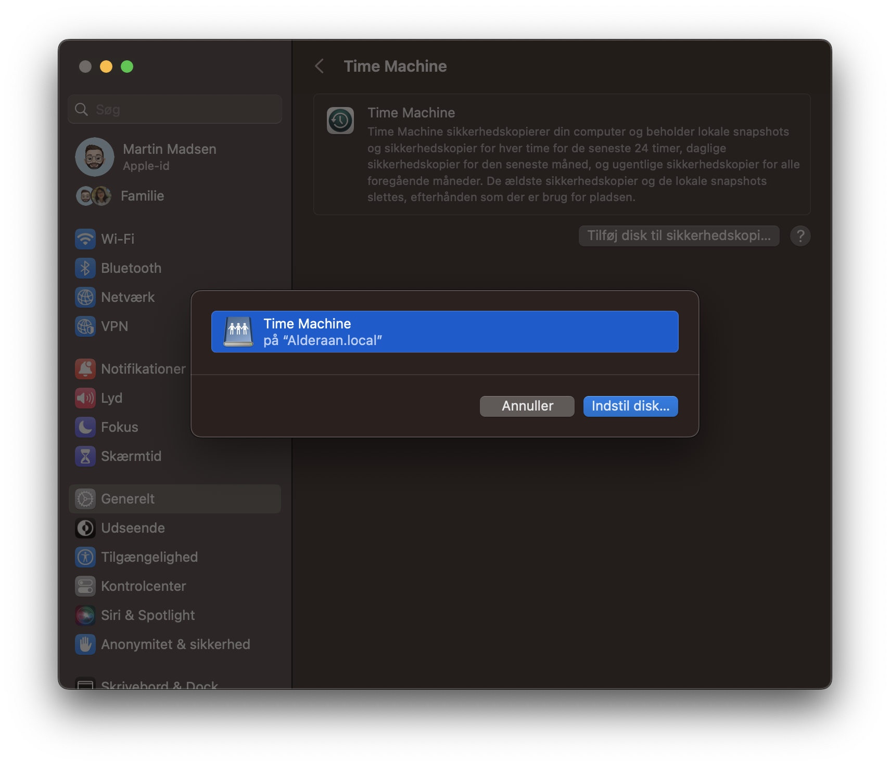

It'll then ask for the credentials of the user account we just created. Pop those
in and hit **Connect**

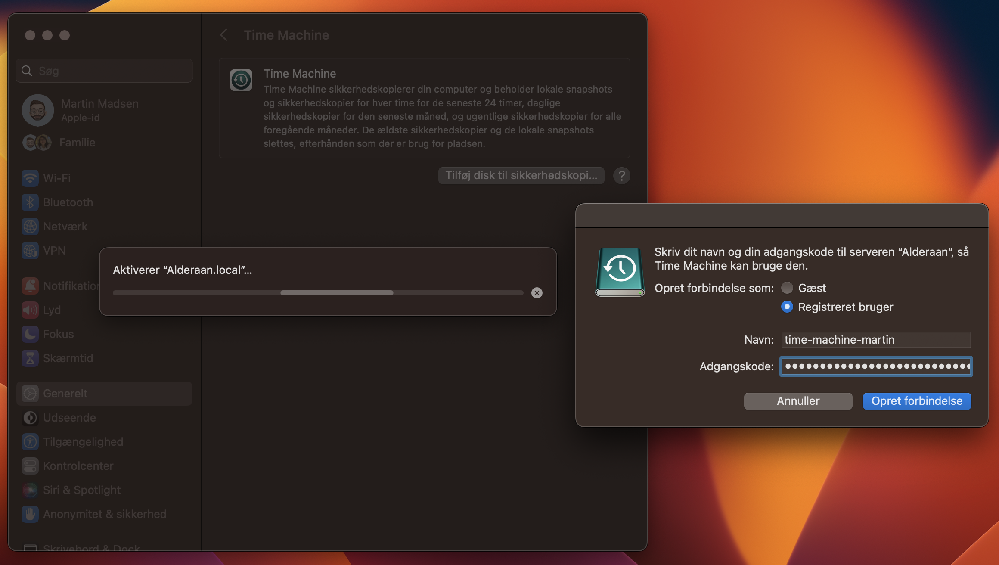

You can then choose to encrypt your Time Machine backup, which I highly
recommend. Generate a random password and store it in 1Password or similar
password manager.

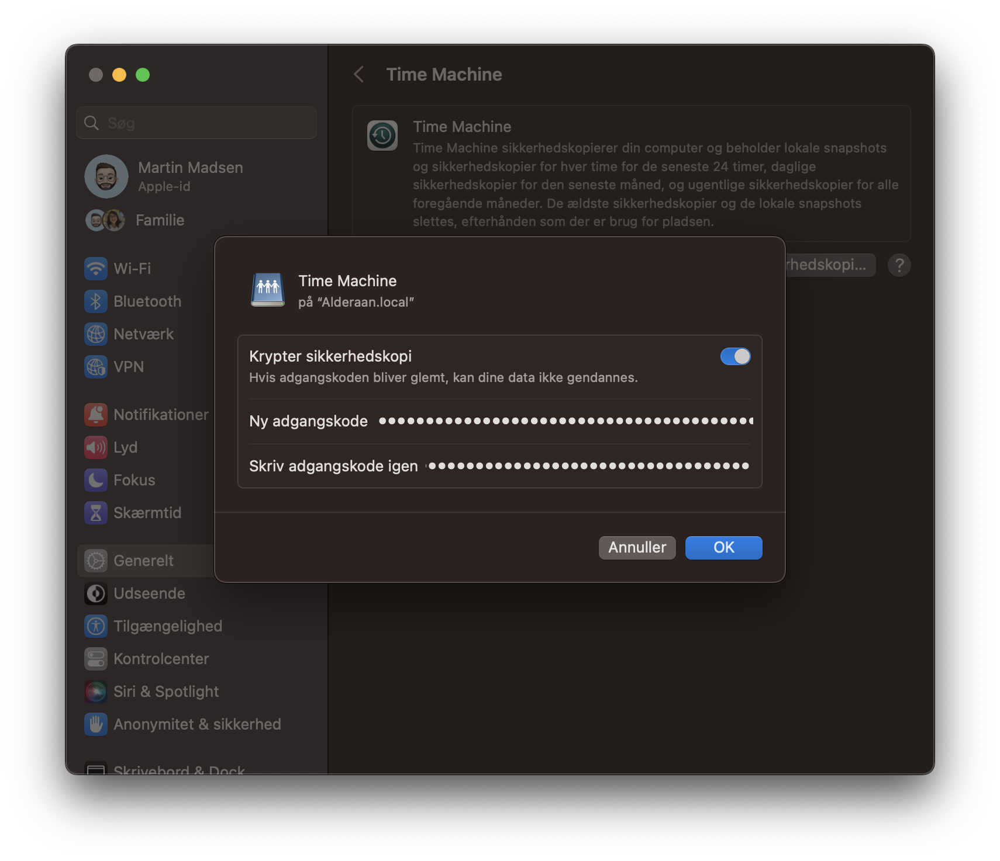

Click **Ok** and Time Machine will connect to your Synology NAS and start backing
up your Mac!

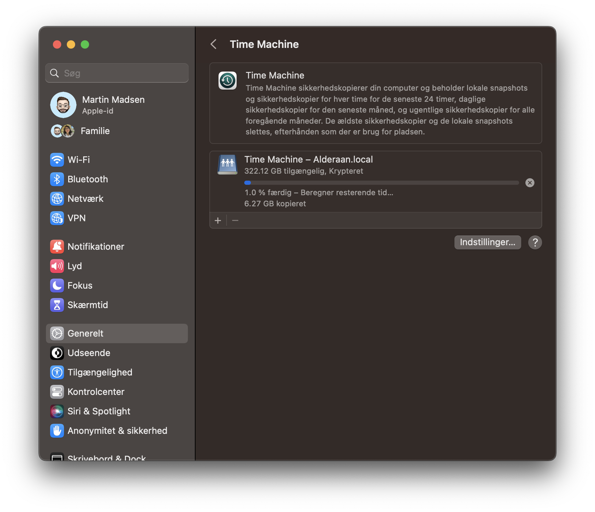

And that's it! Sit back and watch that beautiful progress bar light up.

If you also back up your NAS with Hyper Backup, don't forget to add your new
Time Machine backup to Hyper Backup's folder list.

Hope this helped someone!

## Resources

- [Official Synology Tutorial][official]
- [Guide from Wundertech][wundertech]
- [Some][reddit-1] [Reddit][reddit-2] posts

## Personal notes

Originally I have been backing up all my machines with Arq 7, but costs of
backing up to both AWS S3 Glacier and Backblaze B2 became quite expensive. My
new 3-2-1 backup approach will be to backup our home computers to the NAS using
either Time Machine or Synology Drive backups, then from the Synology NAS to
Backblaze B2 with Synology Hyper Backup.

This is my first time using Time Machine and I've read around the internet that
it can be buggy, so I'll run both Arq and Time Machine in parallel for a couple
of months and try and do some file restores to test its reliability and
performance.

Giving it a shot because I really like the idea of native Apple support with
Time Machine, compared to Arq. And if I can save on cloud storage costs, even
better.

[official]: https://kb.synology.com/en-my/DSM/tutorial/How_to_back_up_files_from_Mac_to_Synology_NAS_with_Time_Machine
[wundertech]: https://www.wundertech.net/how-to-backup-to-a-synology-nas-with-time-machine/
[reddit-1]: https://www.reddit.com/r/synology/comments/t0manx/time_machine_backup_on_synology_nas/
[reddit-2]: https://www.reddit.com/r/synology/comments/13rs974/macos_time_machine_experience_with_synology/
[afp]: https://www.macworld.com/article/234926/using-afp-to-share-a-mac-drive-its-time-to-change.html
[create-user]: https://kb.synology.com/en-my/DSM/help/DSM/AdminCenter/file_user_create?version=7
[ds920]: https://nascompares.com/2020/05/21/synology-ds920-nas-drive-hardware-review/
